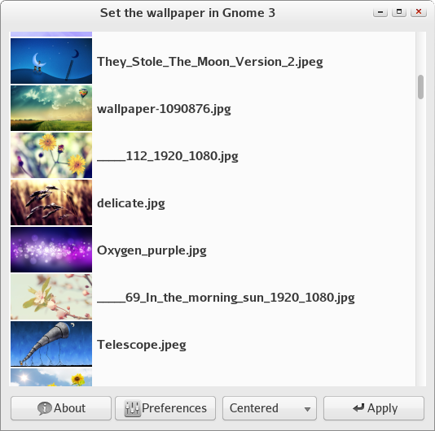
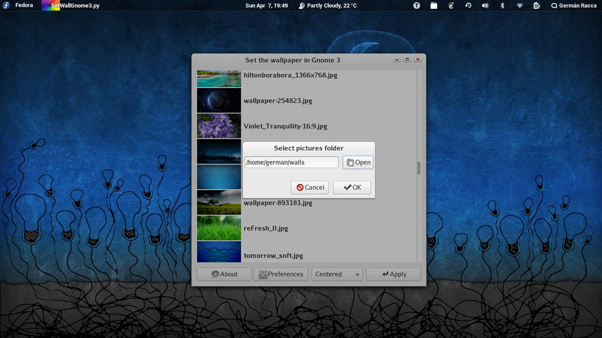
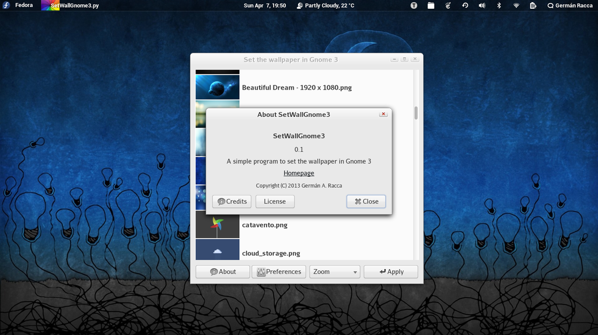

Set the wallpaper in Gnome 3
============================

A simple program to set the wallpaper in Gnome 3.

It is written in [Python](http://www.python.org/) and [Gtk+ 3](http://www.gtk.org/).

*Copyright (C) 2013 Germán A. Racca - <gracca@gmail.com>*

*License: GPLv3+*

How to run
----------

Make it executable:

    $ chmod +x SetWallGnome3.py

and then run it:

    $ ./SetWallGnome3.py

Screenshots
-----------

This is the main window:

This is the preferences dialog:

This is the about dialog:

Have fun!
